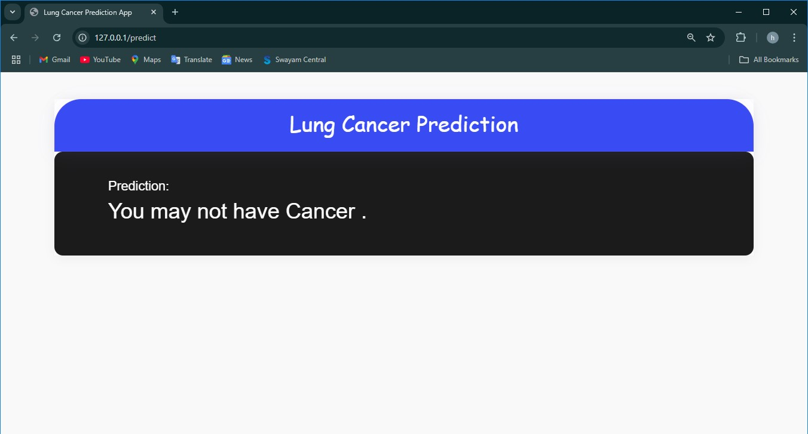

## Lung-Cancer-Prediction
A lung Cancer Prediction system with an accuracy of 99.6%. It predicts the chances of a person suffering from lung Cancer
by taking various health factors as inputs.

## Screenshots
  # Case 1:
  <p align="center">
  
  
  
  
  </p>
  
 # Case 2:
  <p align="center">
  
</p>

## Usage
1. Clone this repository to your local machine.
2. Install the required dependencies:
```
pip install pandas matplotlib Flask scikit-learn 
```
3. Train the model by running:
```
python WebApp/predict.py
```
4. Start the Flask web application with:
```
python WebApp/main.py
```
7. Access the application through your web browser at http://localhost:5000.
8. Fill in the form with the required information.
9. Click the "Submit" button to get the predicted outcome.


